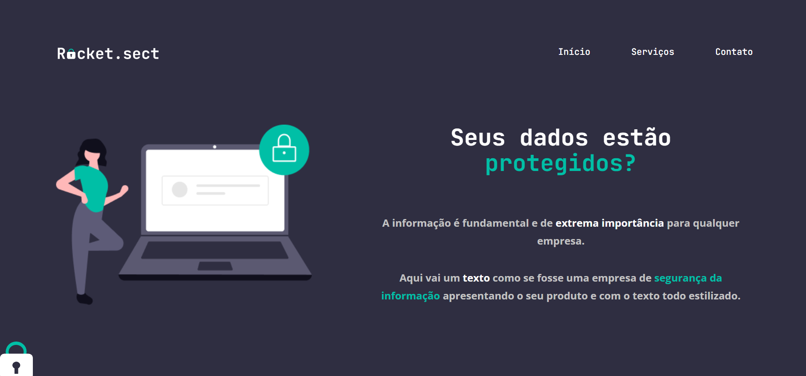

## 💻 Sobre o desafio
Nesse desafio, você deverá recriar uma aplicação, a partir de um layout, para treinar o que aprendeu até agora no Stage 02.

Você pode acessar o layout do fimga <a href="https://www.figma.com/file/EdKjPWjC8ZlbnH4XzTObv2/Explorer/duplicate" target="_blank">neste link</a>

## Quais arquivos devo criar na minha aplicação?

Além de criar a pasta **images** (que será fornecida), que irá conter as imagens da sua aplicação, seu projeto deverá ter os seguintes arquivos:

- *index.html*
- *style.css*

Feito com 💜 por Pedro-Jelev 👋
